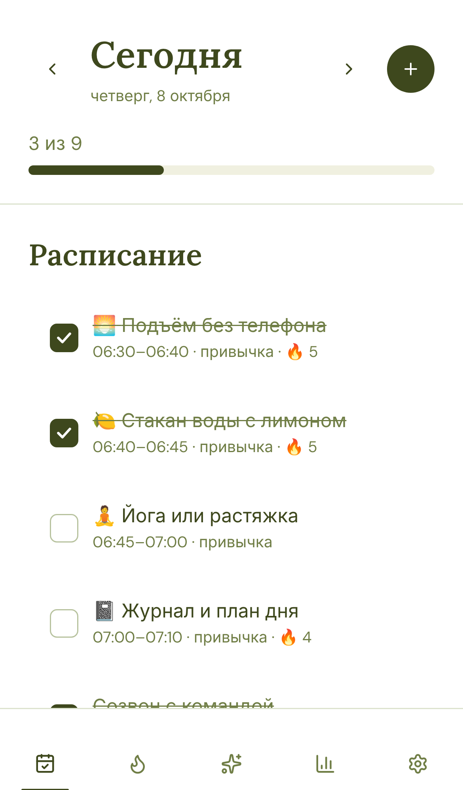
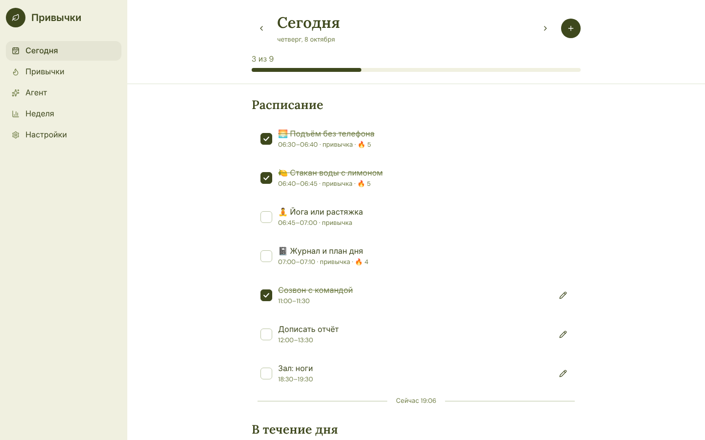

# Привычки и план дня

PWA для iPhone и MacBook: трекер привычек с челленджами из TikTok, лента дня в стиле Structured и ИИ-агент на Claude, который сам раскладывает дела по времени.

| iPhone | Mac |
|---|---|
|  |  |

## Что внутри

- **Сегодня**: лента дня по времени, привычки и задачи с отметкой в одно касание, линия «Сейчас», прогресс дня.
- **Привычки**: серии (🔥), точки за 7 дней, тепловая карта за 12 недель, челленджи из TikTok: 75 Hard, That Girl, 5 AM Club, 12-3-30, Hot Girl Walk, Monk Mode.
- **Агент**: чат с Claude (`claude-opus-5-5`). Он читает план и меняет его сам: добавляет и переносит задачи, создаёт привычки, подводит итоги.
- **Неделя**: выполнение по дням и по привычкам, разбор недели от агента.
- **Синхронизация** iPhone ↔ Mac через ваш сервер. Данные хранятся и на устройстве, так что приложение работает офлайн.

Стек: React 19 + [Astryx](https://github.com/facebook/astryx) (тема matcha), Vite, Node 22 без фреймворков, `@anthropic-ai/sdk`.

## Запуск на своём сервере

Нужны Docker и домен, указывающий на сервер (A-запись). HTTPS обязателен: без него iPhone не установит PWA.

```bash
git clone <repo> habits && cd habits
cp .env.example .env      # впишите DOMAIN, APP_PASSWORD, ANTHROPIC_API_KEY
docker compose up -d --build
```

Caddy сам получит сертификат. Данные лежат в `./data/state.json`: бэкап делается обычным копированием файла.

Без Docker: `npm ci && npm run build`, затем `APP_PASSWORD=... ANTHROPIC_API_KEY=... TRUST_PROXY=1 npm start` за любым reverse proxy с HTTPS. `TRUST_PROXY=1` ставьте только за прокси, иначе ограничение на неверные пароли можно обойти подменой `X-Forwarded-For`.

### Переменные окружения

| Переменная | Зачем |
|---|---|
| `APP_PASSWORD` | Пароль для устройств, не короче 8 символов. Обязателен. |
| `ANTHROPIC_API_KEY` | Ключ Claude для агента. Без него агент выключен, остальное работает. |
| `PORT`, `HOST` | По умолчанию `8787`, `0.0.0.0`. |
| `DATA_DIR` | Где хранить `state.json` (по умолчанию `./data`). |
| `TRUST_PROXY` | `1` за reverse proxy: брать IP клиента из `X-Forwarded-For`. |

## Установка на устройства

- **iPhone**: Safari → ваш домен → «Поделиться» → «На экран Домой». Откройте приложение, вкладка «Ещё» → пароль сервера.
- **Mac**: Safari → «Файл» → «Добавить в Dock» (или значок установки в адресной строке Chrome). Введите тот же пароль.

## Разработка

```bash
npm install
APP_PASSWORD=dev-password npm run dev:server   # API на :8787 (или положите переменные в .env)
npm run dev                                     # Vite на :5173, /api проксируется
npm test                                        # vitest: логика, инструменты агента, HTTP
npm run typecheck
```

Структура:

- `shared/`: модель данных, слияние по записям (last-write-wins), серии, шаблоны челленджей. Используется и клиентом, и сервером.
- `server/`: HTTP (`http.ts`), JSON-хранилище с атомарной записью (`storage.ts`), агент (`agent.ts`) и его инструменты (`tools.ts`).
- `src/`: экраны (`screens/`), состояние и синхронизация (`lib/store.tsx`), тема (`themes/matcha`).

Правила UI-библиотеки описаны в `AGENTS.md`. Справку по компонентам выдаёт `npx astryx component <Name>`.
